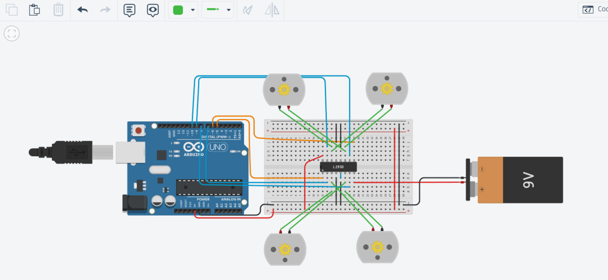
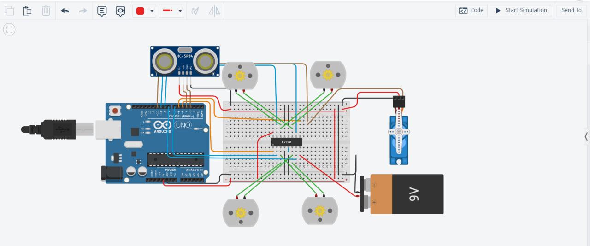

# Arduino-Based Smart Motor Control & Obstacle Avoidance System

## Overview

This project demonstrates the progressive development of an Arduino-based robotic motion control system.

The project begins with basic four-motor motion control using an L293D motor driver and PWM speed control. It is then enhanced with an ultrasonic sensor and a servo-mounted scanning mechanism, allowing the system to detect obstacles and react by changing its direction of motion.

The complete system integrates motion control, distance sensing, and obstacle avoidance into a single robotic control architecture.


## System Development

The project was developed in two stages:

### Part 1 — Four DC Motor Motion Control

The first stage focuses on controlling four DC motors using an Arduino Uno and an L293D motor driver.

The system performs a predefined motion sequence:

1. Move forward for 30 seconds.
2. Move backward for 60 seconds.
3. Alternate between right and left turns for 60 seconds.

PWM signals are used through the L293D Enable pins to control motor speed.

### Part 1 Circuit & Demo 

The following circuit implements the four DC motor motion control system using the Arduino Uno and L293D motor driver.

<p align="center">
  
</p>

▶️ [Watch Part 1 Simulation Demo](demos/PART1_demo%20(1).mp4)


### Part 2 — Obstacle Detection & Autonomous Direction Control

The second stage enhances the original motor control system by integrating:

- Ultrasonic distance sensing
- Servo-based sensor rotation
- Automatic obstacle detection
- Dynamic direction control

The ultrasonic sensor is mounted on the servo motor, allowing it to act as a rotating sensing head.

When an obstacle is detected at a distance of 10 cm or less:

1. The four DC motors stop.
2. The servo rotates the ultrasonic sensor to scan the surroundings.
3. Distance measurements are taken from different directions.
4. The system determines the clearer path.
5. The L293D changes the motor directions to turn the robot.
6. The sensing head returns to its forward position.
7. Normal forward movement continues.

### Part 2 Circuit — Enhanced System & Demo

The original motor control system was extended with an HC-SR04 ultrasonic sensor and a servo-mounted scanning mechanism for obstacle detection and autonomous direction control.

<p align="center">
  
</p>

▶️ [Watch Part 2 Simulation Demo](demos/PART2_demo%20(1).mp4)
## Pin Configuration

| Component | Pin / Function | Arduino Pin |
|---|---|---|
| HC-SR04 Ultrasonic | Echo | D3 |
| HC-SR04 Ultrasonic | Trigger | D4 |
| L293D | Enable 1 (ENA) | D5 (PWM) |
| L293D | Enable 2 (ENB) | D6 (PWM) |
| L293D | IN1 | D7 |
| L293D | IN2 | D8 |
| L293D | IN4 | D9 |
| L293D | IN3 | D10 |
| Servo Motor | Signal | D11 |

## System Architecture

```text
                 ┌─────────────────────┐
                 │  Ultrasonic Sensor  │
                 └──────────┬──────────┘
                            │ Distance
                            ▼
                     ┌─────────────┐
                     │ Arduino Uno │
                     └──────┬──────┘
                            │
              ┌─────────────┴─────────────┐
              │                           │
              ▼                           ▼
       ┌─────────────┐             ┌─────────────┐
       │ Servo Motor │             │    L293D    │
       │ Sensor Scan │             │ Motor Driver│
       └─────────────┘             └──────┬──────┘
                                         │
                                         ▼
                                  ┌──────────────┐
                                  │ 4 × DC Motors│
                                  └──────────────┘
```

## Obstacle Avoidance Logic

```text
                    ┌──────────────────┐
                    │ Normal Operation │
                    └────────┬─────────┘
                             │
                             ▼
                    ┌──────────────────┐
                    │   Move Forward   │
                    └────────┬─────────┘
                             │
                             ▼
                    ┌──────────────────┐
                    │ Measure Distance │
                    └────────┬─────────┘
                             │
                             ▼
                  ┌─────────────────────┐
                  │ Distance ≤ 10 cm ?  │
                  └──────────┬──────────┘
                             │
                    ┌────────┴────────┐
                    │                 │
                   NO                YES
                    │                 │
                    ▼                 ▼
             Continue Forward   ┌─────────────┐
                                │ Stop Motors │
                                └──────┬──────┘
                                       │
                                       ▼
                                ┌─────────────┐
                                │ Scan Right  │
                                └──────┬──────┘
                                       │
                                       ▼
                                ┌─────────────┐
                                │  Scan Left  │
                                └──────┬──────┘
                                       │
                                       ▼
                              ┌───────────────────┐
                              │ Compare Distances │
                              └─────────┬─────────┘
                                        │
                               ┌────────┴────────┐
                               │                 │
                               ▼                 ▼
                         Right Clearer      Left Clearer
                               │                 │
                               ▼                 ▼
                          Turn Right          Turn Left
                               │                 │
                               └────────┬────────┘
                                        │
                                        ▼
                                Continue Forward
```

## Components

- Arduino Uno
- L293D Motor Driver
- 4 × DC Motors
- Servo Motor
- HC-SR04 Ultrasonic Sensor
- Breadboard
- External Motor Power Supply
- Jumper Wires
